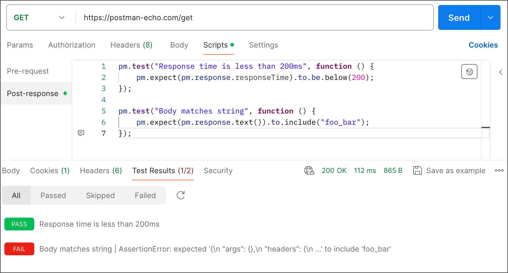
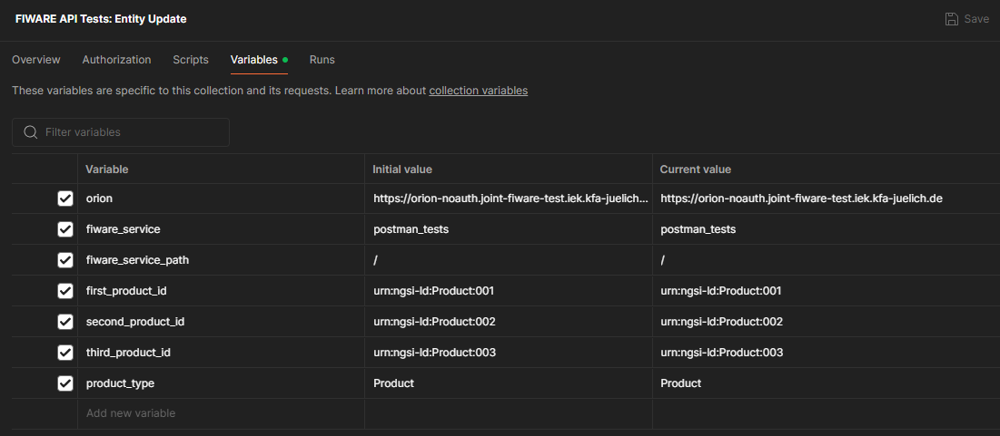

# Fiware API Tests

- [FIWARE Test Cluster](#fiware-test-cluster)
- [Tests with Postman](#tests-with-postman)
  - [Write a Collection of Tests](#write-a-collection-of-tests)
  - [Include Test Collection in GitLab CI](#include-test-collection-in-gitlab-ci)
- [Tests with FIWARE](#tests-with-fiware)

This project includes various test scenarios of the FIWARE infrastructure. Depending on the use case, the FIWARE API is used to ensure that all basic components, such as the Orion Context Broker or the IoT Agent, function reliably. 

Tests confirm that your API is working as expected, that integrations between services are functioning reliably, and that any changes haven't broken existing functionality. In this project, Postman requests are used for direct testing of the API. For more complex scenarios, tests are implemented in Python, using libraries like [FiLiP](https://github.com/RWTH-EBC/FiLiP).

## FIWARE Test Cluster

The following FIWARE components can be used under the specified URLs for the api tests (in Python and Postman):

- Orion Context Broker: https://orion-noauth.joint-fiware-test.iek.kfa-juelich.de
- IoT Agent (JSON): https://iot-agent-noauth.joint-fiware-test.iek.kfa-juelich.de
- QuantumLeap: https://quantumleap.joint-fiware-test.iek.kfa-juelich.de
- CrateDB: https://crate.joint-fiware-test.iek.kfa-juelich.de
- MQTT Broker (with TLS): mqtt://joint-fiware-test.iek.kfa-juelich.de:8883

 
## Tests with Postman

The **Scripts > Post-response** tab of a Postman request allows for any post-processing after a request is sent and includes the ability to write tests for assessing response data. The Post-response tab has the Chai.js library built in, so you can use Chai's behavior-driven development (BDD) syntax to create readable test assertions.

### Write a Collection of Tests

You can add tests to individual requests, collections, and folders in a collection. Postman includes code snippets you add and then change to suit your test logic.

To add tests to a request, open the request and enter your code in the Post-response tab. Tests will execute after the request runs. The output is in the response's Test Results tab.



You can add test scripts to a collection, a folder, or a single request within a collection. A test script associated with a collection will run after every request in the collection.

When you run a collection the collection runner displays the test results, including the response time in milliseconds and details about whether a specific request in the collection passed or failed its tests.

### Include Test Collection in GitLab CI

In the next step you can automate your testing by integrating collection runs within your CI/CD configuration. It is very practical to store important parameters of a test collection, such as the OCB URL or the FIWARE Service, in variables before setting up the pipeline. The image below shows an example of Postman variables in the test case *Entity Update*. Note that the URL of the Orion Context Broker belongs to a joint FIWARE test cluster.



Once a collection is completed, we need to export it in JSON format and store the file in the Git repository. To run a Postman collection in the pipeline, we execute the exported JSON file from the command-line collection runner newman (see the job *postman_tests* inside the *.gitlab-ci.yml*).

An alternative method is to back up your Postman Collections to GitLab, an open-source Git repository manager, with the [Postman to GitLab integration](https://learning.postman.com/docs/integrations/available-integrations/gitlab/).

## Tests with FIWARE

The tests cases implemented in Python can be found under the *validation_tests* directory. The tests
are mainly based on the FiLiP library. To run the tests, you can either set up your local environment or add the tests to a CI/CD pipeline.

### Local testing environment
The local testing environment is recommended for developinp purpose.
Set up a Python environment:
```bash
cd fiware-api-tests
pip install -r requirements.txt
```

To run the tests locally, you will also need to set the environment variables by creating a *.env* file. The necessary variables are:

- LOG_LEVEL
- CB_URL
- IOTA_JSON_URL
- IOTA_URL
- QL_URL  
- MQTT_BROKER_URL
- MQTT_BROKER_URL_INTERNAL
- MQTT_USERNAME (only if required)
- MQTT_PASSWORD (only if required)
- MQTT_TLS (only set to ``True`` if required)
- FIWARE_SERVICE
- FIWARE_SERVICEPATH

The test scripts can be executed with the following command:
```bash
cd validation_tests
python -m unittest discover --verbose . "test_*.py"
```

### CI/CD pipeline
ToDo